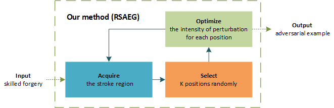
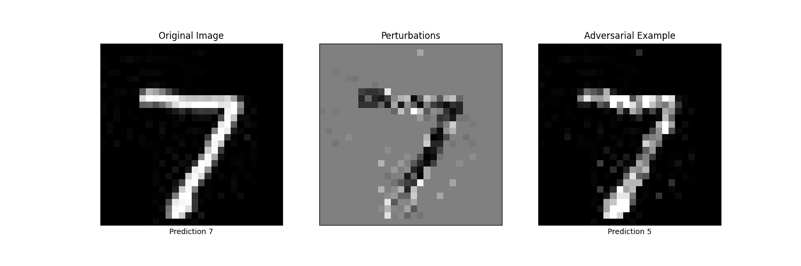

# RAP: Region-restricted Adversarial Perturbation  

By LI Haoyang, modified in Apr. 2021, originally written in Aug. 2019 

This is a **generalized** version of RSAEG:Region-restricted Signature Adversarial Example Generation published in the following paper [Black-box attack against handwritten signature verification with region-restricted adversarial perturbations](http://www.sciencedirect.com/science/article/pii/S0031320320304921).

The originally algorithm was specificly designed for signatures, but it actually applies to any data with clear separate of foreground and background.

</img>

The mechanism is the same as RSAEG as displayed above. At each iteration, the foreground (stroke region) combined with noise (randomly selected positions) is used for the choice of pixels to be perturbed. These selected pixels are optimized using simple binary search according to the query result of the target model. 

Another explanation is that the *Acquire* and *Select* module together approximate the gradient of the target model, the approximated gradient is then used for attack, just as in the white-box case.

**Despite the use of Lp norm-like metrics, it is actually a non-Lp norm attack.** One of the main claim is that perturbations in different places of image have different perceptibility, e.g. tiny perturbations on clean background draw huge attention, while large perturbations on stroke region are non-conspicuous.

</img>

As shown above, RAP attack mainly perturbs the pixels on the stroke region. These perturbations are relatively large, but the adversarial example generated is non-conspicuous, i.e. it looks like a seven written casually, but it is still a seven.

If you use this code, please cite:

```latex
@article{li2020black,
   title={Black-box Attack against Handwritten Signature Verification with Region-restricted Adversarial Perturbations},
   author={Li, Haoyang and Li, Heng and Zhang, Hansong and Yuan, Wei},
   journal={Pattern Recognition},
   pages={107689},
   year={2020},
   publisher={Elsevier}
}
```


